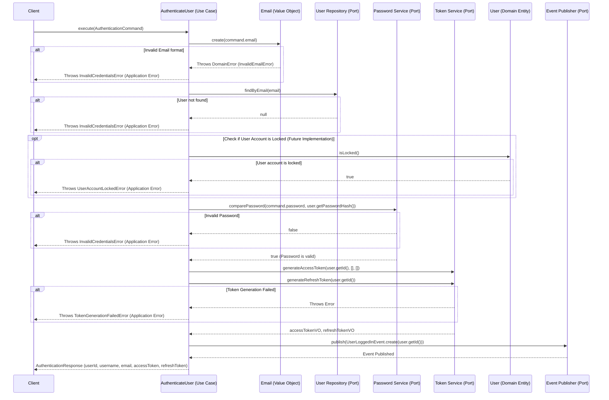

```mermaid
sequenceDiagram
    participant Client
    participant AuthenticateUser as AuthenticateUser (Use Case)
    participant EmailVO as Email (Value Object)
    participant IUserRepository as User Repository (Port)
    participant IPasswordService as Password Service (Port)
    participant ITokenService as Token Service (Port)
    participant UserEntity as User (Domain Entity)
    participant IEventPublisher as Event Publisher (Port)

    Client->>AuthenticateUser: execute(AuthenticationCommand)

    AuthenticateUser->>EmailVO: create(command.email)
    alt Invalid Email format
        EmailVO-->>AuthenticateUser: Throws DomainError (InvalidEmailError)
        AuthenticateUser-->>Client: Throws InvalidCredentialsError (Application Error)
    end

    AuthenticateUser->>IUserRepository: findByEmail(email)
    alt User not found
        IUserRepository-->>AuthenticateUser: null
        AuthenticateUser-->>Client: Throws InvalidCredentialsError (Application Error)
    end

    opt Check if User Account is Locked (Future Implementation)
        AuthenticateUser->>UserEntity: isLocked()
        alt User account is locked
            UserEntity-->>AuthenticateUser: true
            AuthenticateUser-->>Client: Throws UserAccountLockedError (Application Error)
        end
    end

    AuthenticateUser->>IPasswordService: comparePassword(command.password, user.getPasswordHash())
    alt Invalid Password
        IPasswordService-->>AuthenticateUser: false
        AuthenticateUser-->>Client: Throws InvalidCredentialsError (Application Error)
    end
    IPasswordService-->>AuthenticateUser: true (Password is valid)

    AuthenticateUser->>ITokenService: generateAccessToken(user.getId(), [], [])
    AuthenticateUser->>ITokenService: generateRefreshToken(user.getId())
    alt Token Generation Failed
        ITokenService-->>AuthenticateUser: Throws Error
        AuthenticateUser-->>Client: Throws TokenGenerationFailedError (Application Error)
    end
    ITokenService-->>AuthenticateUser: accessTokenVO, refreshTokenVO

    AuthenticateUser->>IEventPublisher: publish(UserLoggedInEvent.create(user.getId()))
    IEventPublisher-->>AuthenticateUser: Event Published

    AuthenticateUser-->>Client: AuthenticationResponse (userId, username, email, accessToken, refreshToken)
```