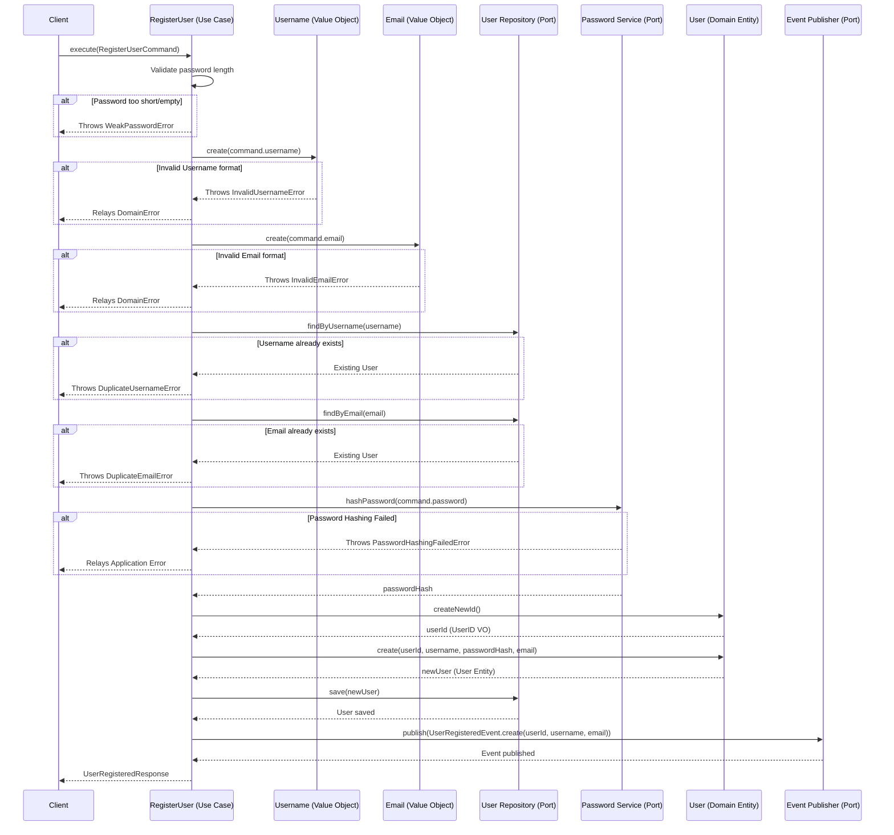

```mermaid
sequenceDiagram
    participant Client
    participant RegisterUser as RegisterUser (Use Case)
    participant UsernameVO as Username (Value Object)
    participant EmailVO as Email (Value Object)
    participant IUserRepository as User Repository (Port)
    participant IPasswordService as Password Service (Port)
    participant UserEntity as User (Domain Entity)
    participant IEventPublisher as Event Publisher (Port)

    Client->>RegisterUser: execute(RegisterUserCommand)

    RegisterUser->>RegisterUser: Validate password length
    alt Password too short/empty
        RegisterUser-->>Client: Throws WeakPasswordError
    end

    RegisterUser->>UsernameVO: create(command.username)
    alt Invalid Username format
        UsernameVO-->>RegisterUser: Throws InvalidUsernameError
        RegisterUser-->>Client: Relays DomainError
    end

    RegisterUser->>EmailVO: create(command.email)
    alt Invalid Email format
        EmailVO-->>RegisterUser: Throws InvalidEmailError
        RegisterUser-->>Client: Relays DomainError
    end

    RegisterUser->>IUserRepository: findByUsername(username)
    alt Username already exists
        IUserRepository-->>RegisterUser: Existing User
        RegisterUser-->>Client: Throws DuplicateUsernameError
    end

    RegisterUser->>IUserRepository: findByEmail(email)
    alt Email already exists
        IUserRepository-->>RegisterUser: Existing User
        RegisterUser-->>Client: Throws DuplicateEmailError
    end

    RegisterUser->>IPasswordService: hashPassword(command.password)
    alt Password Hashing Failed
        IPasswordService-->>RegisterUser: Throws PasswordHashingFailedError
        RegisterUser-->>Client: Relays Application Error
    end
    IPasswordService-->>RegisterUser: passwordHash

    RegisterUser->>UserEntity: createNewId()
    UserEntity-->>RegisterUser: userId (UserID VO)

    RegisterUser->>UserEntity: create(userId, username, passwordHash, email)
    UserEntity-->>RegisterUser: newUser (User Entity)

    RegisterUser->>IUserRepository: save(newUser)
    IUserRepository-->>RegisterUser: User saved

    RegisterUser->>IEventPublisher: publish(UserRegisteredEvent.create(userId, username, email))
    IEventPublisher-->>RegisterUser: Event published

    RegisterUser-->>Client: UserRegisteredResponse
```
